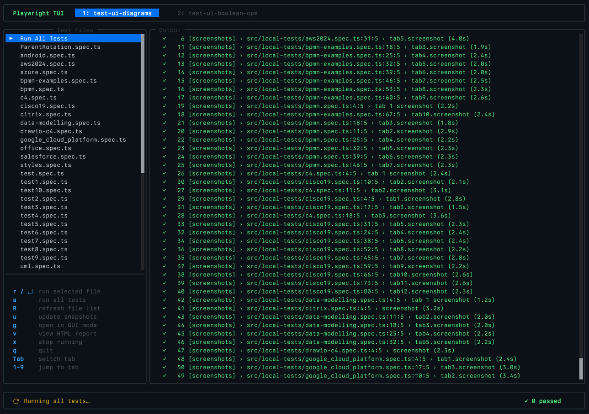

# playwright-tui

A terminal user interface (TUI) for interactively running and managing Playwright test suites.

The purpose is to easily debug, update snapshots and view reports without having to use the Playwright GUI.



## Requirements

- [Bun](https://bun.sh) runtime
- [pnpm](https://pnpm.io) package manager
- A Playwright project with `playwright.config.js/ts` and Playwright installed in its `node_modules`

## Setup

```bash
pnpm install
pnpm run pw:install  # install Chromium browser
```

## Usage

```bash
pnpm start /path/to/your/playwright/project
```

## Keyboard Shortcuts

| Key        | Action                              |
|------------|-------------------------------------|
| `↑` / `↓` | Navigate test file list             |
| `Enter` / `r` | Run selected test file           |
| `a`        | Run all tests                       |
| `R`        | Refresh test file list              |
| `u`        | Update snapshots for selected file  |
| `g`        | Open Playwright GUI mode            |
| `v`        | View HTML report                    |
| `x`        | Stop running tests                  |
| `q` / `Ctrl+C` | Quit                            |
